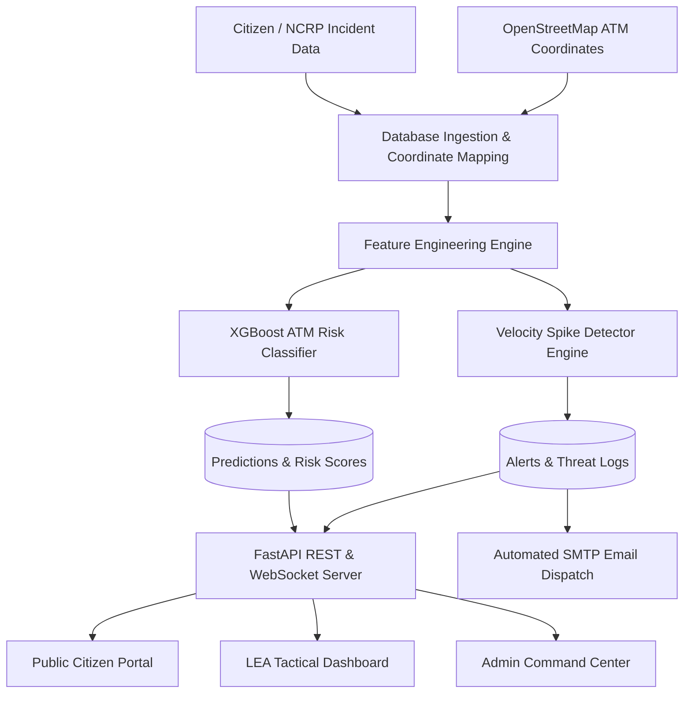
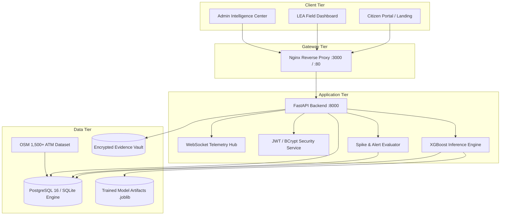
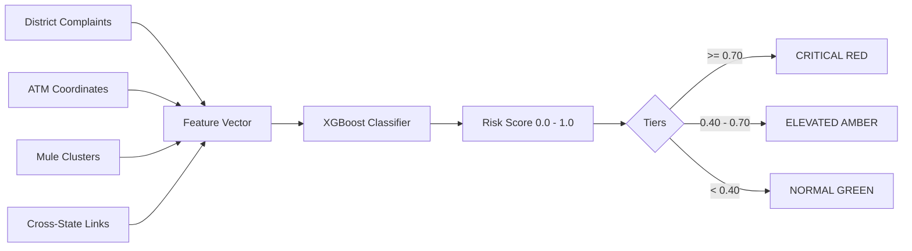
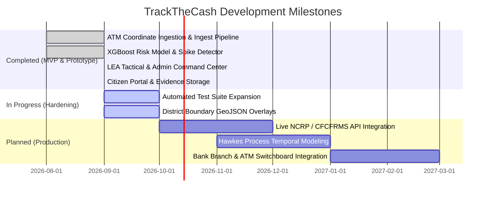

# TrackTheCash — AI-Powered Predictive Analytics Framework for Cybercrime Cash-Withdrawal Locations

> **Smart India Hackathon (SIH 2026)** | Problem Statement: `SIH26184` (Ministry of Home Affairs / Indian Cyber Crime Coordination Centre — I4C)  
> **Mission:** Transform India's cybercrime response from reactive fund blocking to proactive, geographic ATM cash-out defense before illicit cash withdrawal occurs.

---

## 📑 Table of Contents
1. [Executive Summary](#1-executive-summary)
2. [Problem Statement](#2-problem-statement)
3. [Solution Overview](#3-solution-overview)
4. [System Architecture](#4-system-architecture)
5. [Technology Stack](#5-technology-stack)
6. [Machine Learning & Predictive Risk Engine](#6-machine-learning--predictive-risk-engine)
7. [Complaint Velocity Spike Detection](#7-complaint-velocity-spike-detection)
8. [LEA Tactical Surveillance Dashboard](#8-lea-tactical-surveillance-dashboard)
9. [Admin National Command Center](#9-admin-national-command-center)
10. [Citizen Cyber Defense Portal](#10-citizen-cyber-defense-portal)
11. [Data Usage & Privacy Boundary](#11-data-usage--privacy-boundary)
12. [SIH 2026 Requirement Mapping](#12-sih-2026-requirement-mapping)
13. [Limitations & Engineering Honesty](#13-limitations--engineering-honesty)
14. [Development Roadmap](#14-development-roadmap)
15. [Quick Start & Installation](#15-quick-start--installation)
16. [3-Minute Hackathon Demo Script](#16-3-minute-hackathon-demo-script)
17. [Complete API Reference](#17-complete-api-reference)
18. [Project Directory Layout](#18-project-directory-layout)
19. [Documentation Index](#19-documentation-index)
20. [Judge FAQ](#20-judge-faq)
21. [System Verification & Status](#21-system-verification--status)

---

## 1. Executive Summary

India's National Cyber Crime Reporting Portal (NCRP) registers approximately **8,000 complaints per day**, resulting in financial fraud exceeding **₹22,848 crore** lost annually. While existing platforms such as the **CFCFRMS 1930 Helpline** and **MuleHunter.AI** perform reactive fund freezing and mule account blocking across banking rails, money mules systematically withdraw stolen cash from ATMs within **10 to 30 minutes** of a cyber fraud incident.

**TrackTheCash** addresses this critical operational gap. By synthesizing complaint feeds calibrated against I4C national statistics, clustering mule account geographic centroids, and executing a trained **XGBoost Classifier** alongside a rule-based **Velocity Spike Detector**, the platform predicts high-probability cash-out ATM locations across India 24 hours in advance. 

The system delivers real-time geographic intelligence through an interactive **Leaflet.js geospatial interface**, featuring dedicated workspaces for **Law Enforcement Agencies (LEA)**, **I4C National Command Analysts**, and a **Citizen Support Portal** for fraud reporting and anonymous complaint tracking.

---

## 2. Problem Statement

* **The Speed Gap:** Cybercrime victims typically take hours or days to register complaints. However, organized mule rings execute rapid cash withdrawals at physical ATMs in under 30 minutes.
* **Reactive Deficiencies:** Current interventions focus on freezing bank balances. Once cash is physically dispensed from an ATM machine, trace recovery drops drastically.
* **Geographic Blindspot:** Financial transaction logs provide account numbers and timestamps but lack predictive spatial forecasting indicating *where* mules are heading next.
* **Cross-State Coordination Delays:** Fraud committed against a victim in one state (e.g., Rajasthan) frequently routes funds into mule accounts situated in another state (e.g., Uttar Pradesh), introducing jurisdictional friction.

---

## 3. Solution Overview

TrackTheCash unifies data ingestion, machine learning, real-time event distribution, and role-based action workflows:



---

## 4. System Architecture

The architecture utilizes a multi-tier microservice model running locally or via Docker Compose:



---

## 5. Technology Stack

| Layer | Component | Version / Library | Purpose |
| :--- | :--- | :--- | :--- |
| **Frontend UI** | React SPA | React `18.3.1` | Modular client-side user interface |
| **Build & Tooling** | Vite | Vite `5.4.1` | Ultra-fast HMR bundling and static asset build |
| **Routing** | React Router | React Router DOM `6.26.0` | Client-side role-guarded page routing |
| **Geospatial UI** | Leaflet | Leaflet `1.9.4`, React-Leaflet `4.2.1` | Interactive vector maps, risk clusters, ATM popups |
| **Icons & Styling** | Lucide & CSS | `lucide-react`, Custom CSS Tokens | Clean dark-mode intelligence command aesthetics |
| **Backend API** | FastAPI | FastAPI `0.115.0` | High-throughput asynchronous REST API & WebSockets |
| **ASGI Server** | Uvicorn | Uvicorn `0.30.0` | Production ASGI web server |
| **Database ORM** | SQLAlchemy | SQLAlchemy `2.0.0+` | Schema declaration, queries, connection pooling |
| **Database** | PostgreSQL / SQLite | PostgreSQL `16-alpine` / SQLite3 | Relational storage for complaints, ATMs, alerts, mules |
| **Machine Learning** | XGBoost | XGBoost `2.0.0+`, Scikit-learn `1.3.0` | Gradient boosted trees for ATM cash-out probability |
| **Data Processing**| Pandas & NumPy | Pandas `2.0.0+`, NumPy `1.24.0+` | Spatio-temporal feature calculation and aggregations |
| **Authentication** | PyJWT & BCrypt | PyJWT `2.8.0`, BCrypt `4.0.0` | Secure HS256 JWT tokens & hashed credentials |
| **Deployment** | Docker & Compose | Docker Engine `29.8+`, Docker Compose `v5.5+` | Containerized multi-service deployment |

---

## 6. Machine Learning & Predictive Risk Engine

### 6.1 Objective
The ML pipeline predicts the probability $P(\text{Cash-out} \mid \text{ATM}_i, 24\text{h})$ that a given ATM will be used for illicit fraud withdrawal in the upcoming 24-hour window.

### 6.2 Engineered Features (`backend/app/ml/features.py`)
Each ATM feature vector contains five normalized spatio-temporal signals:
1. `district_fraud_density`: Average daily complaint volume in the ATM's district over the preceding 7 days.
2. `complaint_velocity_6h`: Total complaint count recorded in the district within the last 6 hours.
3. `mule_proximity_km`: Haversine distance (in kilometers) from the ATM's coordinate to the geographic centroid of known mule accounts in that district.
4. `atm_count_in_district`: Density of banking ATMs available within the district.
5. `cross_state_flag`: Binary indicator ($1.0$ or $0.0$) signalling active mule transactions across state borders.

### 6.3 Model Architecture & Training (`backend/app/ml/model.py`)
* **Algorithm:** XGBoost Gradient Boosted Classifier (`XGBClassifier`)
* **Hyperparameters:** `n_estimators=100`, `max_depth=4`, `learning_rate=0.08`, `subsample=0.8`, `colsample_bytree=0.8`, `scale_pos_weight` calibrated to class imbalance ratio.
* **Output:** Continuous probability risk score $[0.0, 1.0]$ persisted to the `predictions` database table.



---

## 7. Complaint Velocity Spike Detection

The **Spike Detector** (`backend/app/ml/spike_detector.py`) operates as an autonomous rule-based streaming monitor:

$$\text{Spike Condition} = \left( \text{Count}_{\text{6h}} > 2.0 \times \text{RollingAvg}_{\text{7d}} \right) \land \left( \text{RollingAvg}_{\text{7d}} > 0 \right)$$

* **Cross-State Escalation:** When a spike occurs in a district with active inter-state mule links, the alert severity is automatically escalated from `WARNING` to `CRITICAL`.
* **6-Hour Deduplication:** Prevents alert fatigue by suppressing redundant notification emails to the same district within a 6-hour window.
* **Automated SMTP Dispatch:** Dispatches emergency dispatch notices via SMTP to the relevant jurisdiction unit.

---

## 8. LEA Tactical Surveillance Dashboard

Accessible to field officers (`lea_user`), the LEA Dashboard (`frontend/src/pages/LeaView.jsx`) provides tactical ground response tooling:

* **Interactive Risk Map:** Color-coded Leaflet vector markers depicting 1,500+ ATMs across India.
* **Top-10 Priority Threat Table:** Ranked risk percentages, district locations, bank names, and cross-state indicators.
* **Patrol Deployment:** Single-click field team dispatch logging.
* **Live WebSocket Telemetry:** Real-time updates pushed from backend complaint updates without page refresh.
* **Case Dossier Modal:** Comprehensive investigation view, timeline tracking, and field notes audit trail.

---

## 9. Admin National Command Center

Accessible to I4C administrators (`admin_user`), the Command Center (`frontend/src/pages/AdminView.jsx`) provides strategic national surveillance:

* **Executive Command KPIs:** Real-time metrics on total complaints, active cases, monitored ATMs, and high-risk hotspots.
* **7-Day Velocity Charting:** State-wise temporal trend graphs across high-fraud regions.
* **Inter-State Mule Flow Vectors:** Visualizes money movement between source states and mule withdrawal states.
* **LEA Officer Management:** Provision, deactivate, and audit LEA user credentials.
* **Automated & Manual Alert Center:** Trigger manual emergency broadcasts or review system-generated spike alerts.
* **Simulation Studio:** Execute 2-stage scripted scenarios or toggle random streaming ingestion.
* **Audit Logging & System Health:** Full traceability of all administrative actions, database status, and uptime metrics.

---

## 10. Citizen Cyber Defense Portal

Designed specifically for the general public (`frontend/src/pages/CitizenView.jsx` & `LandingPage.jsx`), this portal empowers citizens while strictly safeguarding confidential police intelligence:

* **Multi-Step Incident Reporting:** Guided 4-step wizard to report fraud with suspect withdrawal state/district mapping.
* **Anonymous Complaint Tracking:** Public tracking via unique complaint ID (e.g. `TTC-2026-000124`) without mandatory sign-in.
* **Evidence Vault:** Secure upload and storage of screenshots, transaction receipts, and chat logs.
* **Case Messaging:** Direct, transparent communication channel with assigned investigation officers.
* **Cyber Safety Center:** Practical safety guides for UPI scams, phishing, job fraud, and ATM skimmers.
* **Suspicious Entity Reporting:** Citizen tip-offs for fraudulent websites, phone numbers, and mule VPAs.

---

## 11. Data Usage & Privacy Boundary

TrackTheCash enforces strict architectural isolation between public citizen data and classified law enforcement intelligence:

```mermaid
graph LR
    subgraph Public Citizen Boundary
        P1[Public Landing Page]
        P2[Report Cyber Fraud Wizard]
        P3[Anonymous Public Tracker]
        P4[Personal Complaint Status]
    end

    subgraph Classified LEA & Admin Boundary
        C1[XGBoost ATM Risk Scores]
        C2[Predicted Cash-Out Hotspots]
        C3[Mule Account Geolocation & Clusters]
        C4[Internal Police Case Notes]
        C5[Inter-State Threat Signal Vectors]
    end

    Public Citizen Boundary -.->|STRICT AIRGAP / AUTH BLOCK| Classified LEA & Admin Boundary
```

---

## 12. SIH 2026 Requirement Mapping

| SIH26184 Problem Statement Requirement | TrackTheCash Implementation | Primary Source Evidence |
| :--- | :--- | :--- |
| **Predictive ATM Cash-Out Risk** | XGBoost classifier calculating 24h rolling probability scores | [`backend/app/ml/model.py`](file:///Users/apple/Documents/Track_The_Cash/backend/app/ml/model.py) |
| **Complaint Velocity Spike Detection** | Rule-based moving average spike detector with 6h window | [`backend/app/ml/spike_detector.py`](file:///Users/apple/Documents/Track_The_Cash/backend/app/ml/spike_detector.py) |
| **Geospatial Visualization** | Interactive Leaflet heatmap with colored risk zones and popups | [`frontend/src/pages/LeaView.jsx`](file:///Users/apple/Documents/Track_The_Cash/frontend/src/pages/LeaView.jsx) |
| **Cross-State Mule Detection** | Inter-state origin vs mule account linkage detection | [`backend/app/routers/predict.py`](file:///Users/apple/Documents/Track_The_Cash/backend/app/routers/predict.py) |
| **Real-Time Alerting** | Automated SMTP notifications + WebSocket live feeds | [`backend/app/routers/alerts.py`](file:///Users/apple/Documents/Track_The_Cash/backend/app/routers/alerts.py) |
| **Citizen Fraud Reporting** | End-to-end incident submission with evidence uploads | [`backend/app/routers/citizen.py`](file:///Users/apple/Documents/Track_The_Cash/backend/app/routers/citizen.py) |
| **Intelligence Export** | Downloadable CSV, JSON, and printable HTML Dossiers | [`backend/app/routers/reports.py`](file:///Users/apple/Documents/Track_The_Cash/backend/app/routers/reports.py) |

---

## 13. Limitations & Engineering Honesty

In alignment with rigorous scientific integrity, the project explicitly acknowledges current prototype constraints:

1. **Synthetic Calibrated Data:** Raw NCRP/CFCFRMS live complaint feeds require restricted government clearance. The database uses synthetic data strictly calibrated to published I4C distributions.
2. **ATM Spatial Coverage:** Ingests 1,500 real Indian ATM coordinates from OpenStreetMap across top high-fraud states rather than the entire national ATM network (approx. 250,000 ATMs).
3. **Demo Authentication:** Uses pre-seeded demonstration credentials (`lea_user`, `admin_user`) alongside dynamic database user models.
4. **Email Simulation:** SMTP alerting is functional but defaults to local fallback when active SMTP environment variables are not supplied.

---

## 14. Development Roadmap



---

## 15. Quick Start & Installation

### Prerequisites
* **Docker & Docker Compose** (Recommended) OR
* **Python 3.11+** and **Node.js 20+**

### Method A: Running with Docker (Recommended)
```bash
# 1. Clone the repository
git clone https://github.com/Prince77x/Track_The_Cash.git
cd Track_The_Cash

# 2. Build and launch all services in background
docker compose up --build -d

# 3. Check service health
docker compose ps
```
* **Frontend Web App:** [http://localhost:3000](http://localhost:3000)
* **Backend API & Swagger Docs:** [http://localhost:8000/docs](http://localhost:8000/docs)

### Method B: Manual Local Setup

#### 1. Backend Setup
```bash
cd backend
python3 -m venv venv && source venv/bin/activate
pip install -r requirements.txt

# Initialize database and ingest ATM records
python scripts/init_db.py
python scripts/fetch_atms.py

# Start FastAPI server
uvicorn app.main:app --host 0.0.0.0 --port 8000 --reload
```

#### 2. Frontend Setup
```bash
cd frontend
npm install
npm run dev
```

---

## 16. 3-Minute Hackathon Demo Script

1. **Step 1: Public Citizen Portal (`/`)**
   * Open `http://localhost:3000` to review the public-safe cyber defense landing page.
   * Demonstrate anonymous complaint status lookup using ID `TTC-2026-000124`.
2. **Step 2: LEA Tactical Surveillance (`/lea`)**
   * Log in via Quick-Fill as **LEA Field Officer** (`lea_user` / `lea_pass`).
   * Observe color-coded ATM markers across high-fraud corridors (UP, Rajasthan, Maharashtra).
   * Click a Red Critical marker (Risk > 70%) to review proximity to suspect mule clusters.
   * Click **"Deploy Patrol"** on the highest-ranked ATM to log active field intervention.
3. **Step 3: Admin Command Center (`/admin`)**
   * Log in via Quick-Fill as **I4C Admin Analyst** (`admin_user` / `admin_pass`).
   * Inspect national overview metrics, 7-day velocity charts, and inter-state mule transfer vectors.
   * Navigate to **Simulation** and trigger **"Inject Demo Spike"**.
   * Observe the automated detection of cross-state anomalies and immediate elevation of ATM risk tiers.
4. **Step 4: Intelligence Dossier Export**
   * Under Reports, generate and download the **LEA Intelligence Dossier** (Printable HTML / CSV) for official field distribution.

---

## 17. Complete API Reference

### 🔐 Authentication (`/auth`)
| Method | Endpoint | Description | Auth Required | Role |
| :--- | :--- | :--- | :--- | :--- |
| `POST` | `/auth/login` | Authenticate user (Demo / LEA / Citizen) and issue JWT | None | Public |
| `POST` | `/auth/register` | Register new citizen account with auto-login token | None | Public |

### 🤖 Predictions & Heatmap (`/predict`, `/heatmap`)
| Method | Endpoint | Description | Auth Required | Role |
| :--- | :--- | :--- | :--- | :--- |
| `GET` | `/predict` | Ranked list of ATMs with 24h risk probabilities | Bearer JWT | Authenticated |
| `GET` | `/predict/metrics` | Model performance metrics, ROC-AUC, and feature importances | Bearer JWT | Authenticated |
| `POST`| `/predict/run` | Trigger on-demand re-scoring of national ATM network | Bearer JWT | Admin |
| `GET` | `/heatmap` | GeoJSON FeatureCollection with severity properties for Leaflet | Bearer JWT | Authenticated |

### 🚨 Alerts & Spike Monitoring (`/alerts`)
| Method | Endpoint | Description | Auth Required | Role |
| :--- | :--- | :--- | :--- | :--- |
| `GET` | `/alerts/feed` | Filterable and searchable feed of threat alerts | Bearer JWT | Authenticated |
| `GET` | `/alerts/spike-check` | Execute on-demand velocity spike detection scan | Bearer JWT | Authenticated |
| `PATCH`| `/alerts/{alert_id}` | Update alert status, assign officer, or add triage notes | Bearer JWT | Authenticated |
| `POST` | `/alerts/trigger` | Dispatch manual emergency broadcast alert via SMTP | Bearer JWT | Admin |

### 📊 Analytics & Reports (`/analytics`, `/reports`)
| Method | Endpoint | Description | Auth Required | Role |
| :--- | :--- | :--- | :--- | :--- |
| `GET` | `/analytics/velocity` | 7-day state-wise complaint velocity trend data | Bearer JWT | Admin |
| `GET` | `/analytics/charts` | Multi-dimensional aggregation for analytics visualization | Bearer JWT | Admin |
| `GET` | `/reports/export` | Export predictions, complaints, or alerts as CSV/JSON | Bearer JWT | Authenticated |
| `GET` | `/reports/dossier` | Printable law enforcement intelligence dossier | Bearer JWT | Authenticated |

### 🛡️ Complaints & Real-Time Telemetry (`/complaints`)
| Method | Endpoint | Description | Auth Required | Role |
| :--- | :--- | :--- | :--- | :--- |
| `GET` | `/complaints` | Paginated complaint records with multi-criteria filtering | Bearer JWT | Authenticated |
| `GET` | `/complaints/latest` | Retrieve latest complaint formatted for prediction scoring | None | Internal |
| `GET` | `/complaints/analytics/stats` | High-level KPI aggregates for LEA command dashboard | Bearer JWT | Authenticated |
| `POST`| `/complaints` | Submit complaint record and broadcast WebSocket event | None | Public / User |
| `PATCH`| `/complaints/{id}/status` | Update complaint status and append audit note | Bearer JWT | Authenticated |
| `WS` | `/complaints/ws` | Real-time WebSocket connection for live telemetry | None | Client Hub |

### 👤 Citizen Portal (`/citizen`)
| Method | Endpoint | Description | Auth Required | Role |
| :--- | :--- | :--- | :--- | :--- |
| `GET` | `/citizen/dashboard` | Aggregated dashboard summary for logged-in citizen | Bearer JWT | Citizen |
| `POST`| `/citizen/complaints` | Multi-step incident reporting wizard submission | Bearer JWT | Citizen |
| `POST`| `/citizen/complaints/{id}/evidence` | Secure upload of incident files, receipts, screenshots | Bearer JWT | Citizen |
| `GET` | `/citizen/track/{public_id}` | Public anonymous complaint tracking by public ID | None | Public |
| `GET` | `/citizen/safety-guides` | List published cyber safety guides and prevention tips | None | Public |

---

## 18. Project Directory Layout

```text
Track_The_Cash/
├── backend/
│   ├── app/
│   │   ├── ml/
│   │   │   ├── features.py          # Spatio-temporal feature extraction
│   │   │   ├── model.py             # XGBoost model training & inference
│   │   │   └── spike_detector.py    # Rule-based complaint velocity engine
│   │   ├── routers/
│   │   │   ├── admin.py             # Admin command & officer management
│   │   │   ├── alerts.py            # Alert triage & SMTP triggers
│   │   │   ├── analytics.py         # Velocity trends & charting endpoints
│   │   │   ├── auth.py              # JWT authentication & registration
│   │   │   ├── citizen.py           # Citizen dashboard, evidence, & guides
│   │   │   ├── complaints.py        # Complaint management & WebSocket hub
│   │   │   ├── heatmap.py           # GeoJSON generation for Leaflet
│   │   │   ├── predict.py           # ATM risk prediction scoring
│   │   │   ├── reports.py           # CSV/JSON exports & printable dossiers
│   │   │   └── simulation.py        # Spike injection & streaming control
│   │   ├── auth.py                  # Token verification & RBAC decorators
│   │   ├── config.py                # Pydantic environment configuration
│   │   ├── database.py              # SQLAlchemy engine & session factory
│   │   ├── email_service.py         # SMTP email dispatcher
│   │   ├── main.py                  # FastAPI application entry point
│   │   ├── models.py                # Database schemas & relationships
│   │   ├── schemas.py               # Pydantic request/response schemas
│   │   └── storage.py               # Local evidence file storage manager
│   ├── scripts/
│   │   ├── atm_locations.csv        # Seed dataset of Indian ATM coordinates
│   │   ├── fetch_atms.py            # ATM coordinate ingestion script
│   │   ├── generate.py              # Calibrated synthetic data generator
│   │   ├── init_db.py               # Database schema initialization
│   │   └── train_model.py           # Model training and artifact generation
│   ├── tests/                       # Pytest test suite
│   ├── Dockerfile                   # Python backend container definition
│   ├── entrypoint.sh                # Container startup sequence
│   └── requirements.txt             # Python dependencies
├── frontend/
│   ├── src/
│   │   ├── components/
│   │   │   ├── AlertFeed.jsx        # Threat feed list component
│   │   │   ├── ComplaintDetailModal.jsx # Full investigation case modal
│   │   │   ├── ComplaintTable.jsx   # Tabular complaint browser
│   │   │   ├── Navbar.jsx           # Global intelligence header
│   │   │   ├── ProtectedRoute.jsx   # Role-based route authorization guard
│   │   │   ├── RiskMap.jsx          # Leaflet map container
│   │   │   └── SubmitComplaintModal.jsx # Quick complaint submission
│   │   ├── context/
│   │   │   └── AuthContext.jsx      # React authentication state provider
│   │   ├── pages/
│   │   │   ├── AdminView.jsx        # Admin National Command Center
│   │   │   ├── CitizenView.jsx      # Citizen User Dashboard & Wizard
│   │   │   ├── LandingPage.jsx      # Public-safe cyber defense home page
│   │   │   ├── LeaView.jsx          # LEA Tactical Surveillance Dashboard
│   │   │   └── Login.jsx            # Multi-role authentication page
│   │   ├── App.jsx                  # Main routing & application layout
│   │   └── main.jsx                 # React root mounting
│   ├── Dockerfile                   # Node build & Nginx serve container
│   ├── nginx.conf                   # Nginx reverse proxy configuration
│   └── package.json                 # Frontend dependencies
├── docs/
│   └── PRD.md                       # Product Requirements Document
├── docker-compose.yml               # Multi-container orchestration specification
└── README.md                        # Master repository documentation
```

---

## 19. Documentation Index

| Document | Purpose |
| :--- | :--- |
| [`docs/PRD.md`](file:///Users/apple/Documents/Track_The_Cash/docs/PRD.md) | Product Requirements Document outlining functional and non-functional specifications |
| [`docs/literature_review.md`](file:///Users/apple/Documents/Track_The_Cash/docs/literature_review.md) | Comprehensive review of Indian cybercrime statistics and spatial risk literature |
| [`docs/agents/domain.md`](file:///Users/apple/Documents/Track_The_Cash/docs/agents/domain.md) | Domain glossary and architectural decision records (ADR) |
| [`AGENTS.md`](file:///Users/apple/Documents/Track_The_Cash/AGENTS.md) | Repository conventions and operational guidelines |

---

## 20. Judge FAQ

#### Q1: What makes TrackTheCash different from standard cybercrime portals?
**A:** Standard portals (like NCRP) are purely reactive recording systems. TrackTheCash is proactive: it forecasts the physical ATM locations where stolen funds are most likely to be cashed out within the next 24 hours, enabling preventive field team deployment.

#### Q2: What machine learning model is utilized?
**A:** An **XGBoost Classifier** (`XGBClassifier`) trained on spatio-temporal features including 6-hour complaint velocity, 7-day district complaint density, mule proximity distance (Haversine km), district ATM density, and cross-state indicators.

#### Q3: Is real citizen data used in this hackathon prototype?
**A:** No. Strict privacy and legal standards prohibit using unredacted NCRP citizen data. The prototype uses a synthetic dataset calibrated against official I4C state distributions, crime type ratios, and average fraud amounts.

#### Q4: How is confidential police intelligence protected from public view?
**A:** The platform implements a strict privacy boundary. The public landing page and citizen views expose only general safety guides and personal complaint statuses. ATM risk scores, mule cluster centroids, police notes, and XGBoost internals are accessible exclusively to authenticated LEA and Admin roles.

---

## 21. System Verification & Status

| Module / Component | Implementation Status | Evidence / Verification |
| :--- | :--- | :--- |
| **Authentication & RBAC** | ✅ Implemented & Active | JWT + BCrypt in [`backend/app/auth.py`](file:///Users/apple/Documents/Track_The_Cash/backend/app/auth.py) |
| **XGBoost Predictive Engine** | ✅ Implemented & Trained | 5 features in [`backend/app/ml/model.py`](file:///Users/apple/Documents/Track_The_Cash/backend/app/ml/model.py) |
| **Velocity Spike Detector** | ✅ Implemented & Active | Rule detector in [`backend/app/ml/spike_detector.py`](file:///Users/apple/Documents/Track_The_Cash/backend/app/ml/spike_detector.py) |
| **LEA Surveillance Dashboard**| ✅ Implemented & Verified | React + Leaflet in [`frontend/src/pages/LeaView.jsx`](file:///Users/apple/Documents/Track_The_Cash/frontend/src/pages/LeaView.jsx) |
| **Admin Command Center** | ✅ Implemented & Verified | Charts + Simulation in [`frontend/src/pages/AdminView.jsx`](file:///Users/apple/Documents/Track_The_Cash/frontend/src/pages/AdminView.jsx) |
| **Citizen Portal & Wizard** | ✅ Implemented & Verified | Multi-step form in [`frontend/src/pages/CitizenView.jsx`](file:///Users/apple/Documents/Track_The_Cash/frontend/src/pages/CitizenView.jsx) |
| **Evidence File Vault** | ✅ Implemented & Active | Disk storage in [`backend/app/storage.py`](file:///Users/apple/Documents/Track_The_Cash/backend/app/storage.py) |
| **Docker Compose Deployment**| ✅ Implemented & Verified | Multi-container setup in [`docker-compose.yml`](file:///Users/apple/Documents/Track_The_Cash/docker-compose.yml) |

---

## 👥 Project Contributors
* **Mohit** — DevOps, Data Pipelines, & Containerization
* **Shubham** — Machine Learning, Feature Engineering, & Evaluation
* **Hari** — Backend APIs, Database Architecture, & JWT Security
* **Prince** — Frontend Architecture, Leaflet Geospatial UI, & Command Dashboards

---

*TrackTheCash — Built for Smart India Hackathon (SIH 2026) | Problem Statement SIH26184 (MHA / I4C)*
